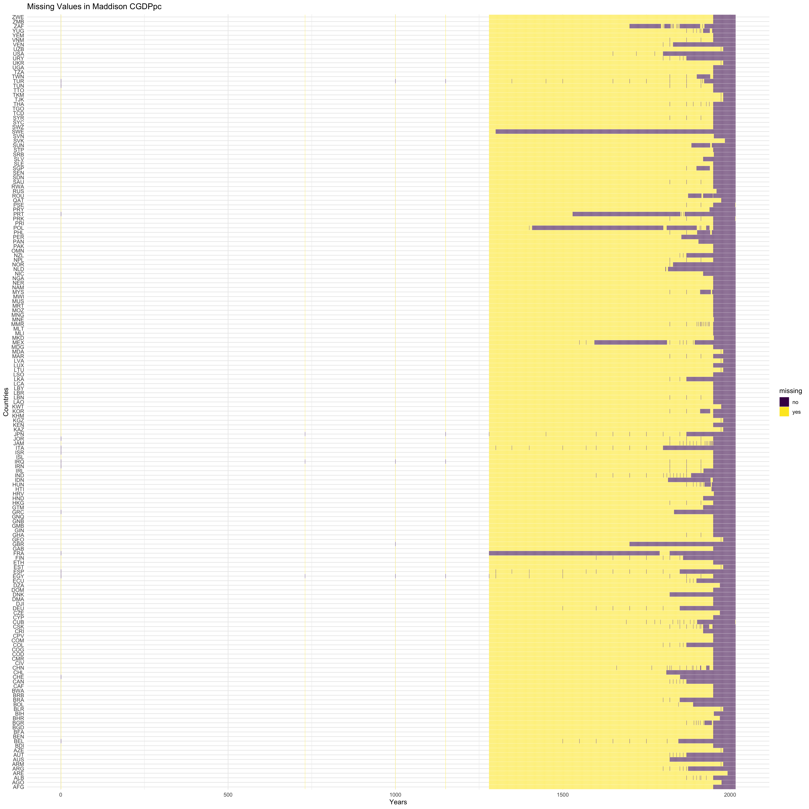

# Missing values

```{r eval=FALSE}
#libraries
library(tidyr)
library(tidyverse)
library(ggplot2)
library(dplyr)
library(extracat)
```

Examine Missing Values for Colonial Data set (created in data cleaning)
```{r}
colonialdata <- read.csv("Data/clean/colonialdata.csv")

missvalues <-colonialdata %>%rownames_to_column("id") %>%gather(key, value, -id) %>%mutate(missing =ifelse(is.na(value), "yes", "no"))

ggplot(missvalues, aes(x = key, y =fct_rev(id), fill = missing)) +geom_tile(color ="white") +ggtitle("Missing Values in Colonialdata") +scale_fill_viridis_d() + theme_bw() + coord_flip() + labs(x = "Column Names", y = "Countries")
```
From this, it seems that most countries have values for most data. There are a few missing values in ColRulerCode, this is because some countries were colonized by Austria-Hungary, which does not now exist and therefore has no iso3 code.

Per capita GDP has a single missing value for Taiwan, I'm not very sure why this is the case, it just wasn't part of the UN dataset. This might have to do with the China-Taiwan conflict.

The gini coefficient and human development index adjusted for inequality (IHDI) both have many missing values. That IHDI had more missing values than the human development index (HDI) surprised me, I expected that both HDI and IHDI to have more many, but about the same amount of missing values, and to have more missing values than the gini coefficient. This is because I felt that since HDI requires a combination of information it would be less available. Instead it seems that information regarding inequality is the least available, since this is fairl numeric (involving incomes/wealth) that tend to be reasonably well documented due to taxation, I was surprised that there was so much missing information on the subject


Examine Missing values for England gdp
```{r}
England <- read.csv("Data/clean/EnglandGDPpc.csv")

missvalues <-England %>%gather(key, value, -year) %>%mutate(missing =ifelse(is.na(value), "yes", "no"))

ggplot(missvalues, aes(x = key, y=year, fill = missing)) +geom_tile(color ="white") + ggtitle("Missing Values in England GDP per capita data") +scale_fill_viridis_d() + theme_bw() + coord_flip() + labs(x = "Years") + theme(axis.text.x = element_text(angle = 90))
```

Examining the GDP data available for England we can see that, while there are values at 0, 500, and 1000, a great deal of data in that time period doesn't appear. This information is not colored yellow for missing simply because those years are not even listed in the dataset. Because the rgdp and cgdp columns combine information on England and the UK they have the most filled values, including every year from about 1200 onwards. We use this data to examine the per capita gdp of England overtime


Examine Missing Values for Maddison per capita GDP
per country that I examine

```{r fig.height = 20}
Mad <- read.csv("Data/clean/Maddison.csv")
#This data was reformatted here simply for the purposes of the missing values analysis
Madcleanc <- spread(subset(Mad, select = -c(country,pop,i_cig, i_bm, rgdpnapc)), key = countrycode, value = cgdppc)
#Madcleanr <- spread(subset(Mad, select = -c(country,pop,i_cig, i_bm, cgdppc)), key = countrycode, value = rgdpnapc)

missvaluesc <- Madcleanc %>%gather(key, value, -year) %>%mutate(missing =ifelse(is.na(value), "yes", "no"))
#missvaluesr <- Madcleanr %>%gather(key, value, -year) %>%mutate(missing =ifelse(is.na(value), "yes", "no"))
missvaluesc1800 <- filter(Madcleanc, year >1800) %>%gather(key, value, -year) %>%mutate(missing =ifelse(is.na(value), "yes", "no"))
#missvaluesr1800 <- filter(Madcleanr, year >1800) %>%gather(key, value, -year) %>%mutate(missing =ifelse(is.na(value), "yes", "no"))
  
mc <- ggplot(missvaluesc, aes(x = key, y =year, fill = missing)) +geom_tile(color ="white") +ggtitle("Missing Values in Maddison CGDPpc") +scale_fill_viridis_d() + theme_bw() + coord_flip() + labs(x = "Countries", y = "Years") + theme(axis.text.x = element_text(angle = 90)) + theme_minimal(base_size=12)

#mr <-  ggplot(missvaluesr, aes(x = key, y =year, fill = missing)) +geom_tile(color ="white") +ggtitle("Missing Values in Maddison RGDPpc") +scale_fill_viridis_d() + theme_bw() + coord_flip() + labs(x = "Countries", y = "Years") + theme(axis.text.x = element_text(angle = 90)) + theme_minimal(base_size=12)

mc1800 <- ggplot(missvaluesc1800, aes(x = key, y =year, fill = missing)) +geom_tile(color ="white") +ggtitle("Missing Values in Maddison CGDPpc") +scale_fill_viridis_d() + theme_bw() + coord_flip() + labs(x = "Countries", y = "Years") + theme(axis.text.x = element_text(angle = 90)) + theme_minimal(base_size=12)

#mr1800 <-  ggplot(missvaluesr1800, aes(x = key, y =year, fill = missing)) +geom_tile(color ="white") +ggtitle("Missing Values in Maddison RGDPpc") +scale_fill_viridis_d() + theme_bw() + coord_flip() + labs(x = "Countries", y = "Years") + theme(axis.text.x = element_text(angle = 90)) + theme_minimal(base_size=12)

ggsave("img/MadPmissingGDPC.png", mc, width=20, height=20)
#ggsave("img/MadGDPmissingGDPR.png", mr, width=20, height=20)
ggsave("img/MadPmissingGDPC1800.png", mc1800, width=20, height=20)
#ggsave("MadPmissingGDPR1800.png", mr1800, width=20, height=20)
```




(The files have been saved for convenience of viewing and are under the github img/ folder.)

Looking at this data it's clear that there is very little data available prior to 1800, It only exists for select years ex(500,1000,1500). As in the previous chart we can see that as those years are empty space.

In the graph that provides a closer look at country's per capita GDP's after 1800s. Countries with more data available than others include:
-South Africa
-Venezuela
-United States
-Uruguay
-Sweden
-Soviet Union
-Portugual
-Netherlands
-Norway
-Poland
-Peru
-Sri Lanka
-Mexico
-Japan
-Italy
-Indonesia
-Greece
-UK
-France
-Denmark
-Spain
-China
-Chile
-Brazil
-Australia
-Argentina

These are some countries that would likely be more interesting to look at in terms of gdp overtime, simply because the data is more available.

```{r}
transformations = read.csv('Data/clean/transformations.csv')
visna(transformations)
```

Upon inspection, the countries which are missing Data fall into the following patterns:
- Countries that are missing only one value: Egypt, Jordania, Lesotho. Said values are absent from the original csv presented on the University of Zurich website.
- Mongolia, who is missing Colonization beginning and end dates, and has all "present" values set to 0. Similarly:
- Singapour, Brunei and Hong Kong, who have no encoded values. All 4 countires, while presented for the database, seemed to have been considered by the researchers as out of the scope of their studies and their scores should not be considered.

```{r echo=FALSE, eval=FALSE}
for (r in 1:86) {
  x = sum(is.na(transformations[r,]))
  if (x > 0) {
    print(x)
    print(transformations[r,1])
  }
}
```

